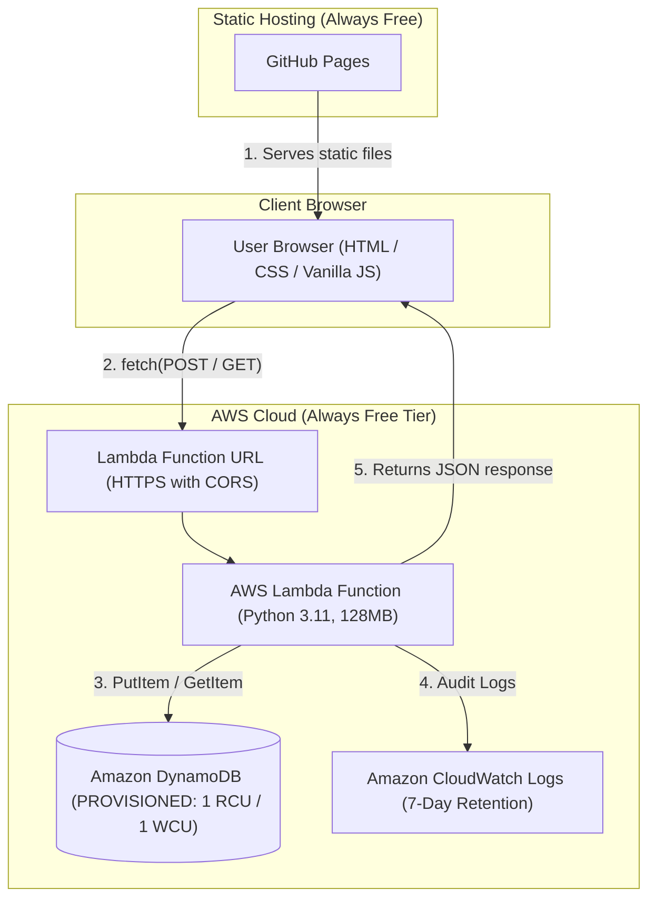

# Daily Scrum Serverless (100% Always Free)

A zero-cost, permanent serverless Daily Scrum tracker powered by AWS Lambda, Amazon DynamoDB, and GitHub Pages.

---

## 🏗️ Architecture Overview

The system decouples the static presentation layer (Client-Side Rendering) from the serverless backend, eliminating idle server costs and ongoing API Gateway fees.



---

## 💡 Why It Is "Always Free" (Permanent Cost Zero)

Many serverless architectures incur unexpected charges once initial 12-month promotional tiers expire. This design is engineered specifically against the AWS **Always Free** guarantees:

| Component | AWS Pricing Tier | Limit / Configuration | Notes |
| :--- | :--- | :--- | :--- |
| **AWS Lambda** | **Always Free** | 1,000,000 requests/mo & 400,000 GB-seconds compute | Exceedingly sufficient for team daily updates. |
| **Lambda Function URL** | **Always Free** | Included in Lambda invocation pricing | Replaces **Amazon API Gateway** (which charges after 12 months). |
| **Amazon DynamoDB** | **Always Free** | 25 GB storage, 25 WCU / 25 RCU (Provisioned) | Configured with `1 RCU / 1 WCU` to guarantee permanent free usage. |
| **CloudWatch Logs** | **Always Free** | 5 GB monthly log ingestion / archive | Automated `7-day retention` policy prevents disk storage buildup. |
| **GitHub Pages** | **Always Free** | 100 GB monthly bandwidth, unlimited free static hosting | Free HTTPS, zero cloud hosting bills. |

---

## 📁 Repository Structure

```
.
├── deploy.sh              # Automated, idempotent AWS CLI deployment script
├── lambda_function.py     # Clean Python 3.11 handler using native boto3 & REST verbs
├── index.html             # Static client-side frontend served by GitHub Pages
├── frontend/
│   └── index.html         # Mirror copy of the frontend
├── docs/                  # Detailed architectural and technical specifications
│   ├── architecture.md    # In-depth architectural trade-offs and zero-cost design
│   ├── data-model.md      # DynamoDB single-table design and access patterns
│   ├── backend.md         # Lambda handler implementation, CORS, and error handling
│   ├── frontend.md        # Client-side component architecture and DOM updates
│   └── deployment.md      # deploy.sh execution lifecycle and IAM security
├── .gitignore             # Ignores packages, zip files, and environments
└── README.md              # Technical and operational documentation
```

---

## 📚 In-Depth Technical Documentation

For deep technical specifications, refer to the guides in the [`docs/`](docs/) directory:
* [**Architecture Deep-Dive**](docs/architecture.md): Trade-offs, extreme serverless patterns, and why API Gateway/SSR were avoided.
* [**DynamoDB Data Model**](docs/data-model.md): Primary key strategy (`PK`/`SK`), single-table design, and query complexity.
* [**Backend Handler Reference**](docs/backend.md): Ingress payload v2 format, CORS preflight, base64 decoding, and status codes.
* [**Frontend Reference**](docs/frontend.md): Client-Side Rendering (CSR), DOM lifecycle, and asynchronous fetch integration.
* [**Deployment Lifecycle**](docs/deployment.md): Idempotency, IAM least-privilege scoping, and automated resource provisioning.

---

## 🚀 Deployment Guide

### Prerequisites
1. [AWS CLI v2](https://docs.aws.amazon.com/cli/latest/userguide/getting-started-install.html) installed (version `2.32.0` or higher recommended).
2. Active AWS account with permissions for IAM, Lambda, DynamoDB, and CloudWatch.

### Step 1: Authenticate AWS CLI
Authenticate your terminal using short-term auto-rotating credentials:
```bash
aws login
```
*(Follow the browser prompt to approve the session).*

### Step 2: Deploy Backend Infrastructure
Run the automated deployment script from the project root:
```bash
chmod +x deploy.sh
./deploy.sh
```

The script will:
1. Provision the `DailyScrum` DynamoDB table in `PROVISIONED` mode (`1 RCU / 1 WCU`).
2. Create the CloudWatch log group with a strict `7-day` retention window.
3. Configure an IAM execution role with least-privilege policies scoped to the `DailyScrum` table.
4. Package and deploy `lambda_function.py` to AWS Lambda (using built-in `boto3`, no heavy vendor folders).
5. Create a public **Lambda Function URL** with CORS headers enabled.

Upon completion, the script prints your public HTTPS endpoint:
```
==========================================================
 Deployment Complete!
 Lambda Function URL (Always Free Endpoint):
 https://xxxxxxxxxxxxxxxxxxxxxxxxxxxxxxxx.lambda-url.us-east-1.on.aws/
==========================================================
```

---

## 🌐 Connecting the Frontend

1. Open the live frontend at:
   **[https://jmrodev.github.io/daily-scrum-serverless/](https://jmrodev.github.io/daily-scrum-serverless/)**
2. Paste your **Lambda Function URL** into the configuration field at the top.
3. Use the interface to:
   - **Submit Daily Scrums (`POST`):** Record yesterday's work, today's focus, and impediments.
   - **Load Daily Scrums (`GET`):** Fetch team updates for a specific project, week, day, and member.

---

## 🔌 API Specification

The Lambda Function URL supports standard REST HTTP requests:

### 1. Record Daily Scrum
* **Method:** `POST`
* **Content-Type:** `application/json`
* **Payload:**
```json
{
  "project": "Sabato",
  "week": "WEEK 9",
  "day": "Lunes",
  "member": "Paz",
  "answers": [
    "Completed unit tests",
    "Working on API integration",
    "No current blockers"
  ]
}
```
* **Response:** `201 Created`

### 2. Retrieve Daily Scrum
* **Method:** `GET`
* **Query Parameters:** `?project=Sabato&week=WEEK%209&day=Lunes&member=Paz`
* **Response:** `200 OK`
```json
{
  "message": "Daily Scrum loaded for Paz (WEEK 9 - Lunes)",
  "answers": [
    "Completed unit tests",
    "Working on API integration",
    "No current blockers"
  ]
}
```

---

## 🔐 Security Notes
* **CORS:** Pre-configured with permissive origins (`*`) for easy GitHub Pages integration. You can lock this down in `deploy.sh` to `https://jmrodev.github.io` for production hardening.
* **IAM Least Privilege:** The Lambda execution role has strictly bounded permissions allowing only `PutItem`, `GetItem`, `UpdateItem`, and `Query` on the `DailyScrum` DynamoDB table ARN.
