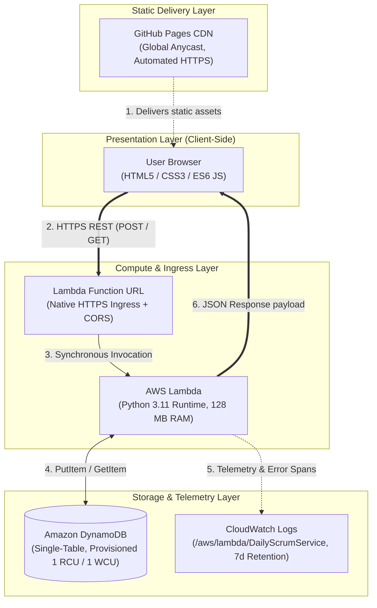

# System Architecture Deep-Dive

This document details the architectural decisions, structural boundaries, and technical trade-offs of the **Daily Scrum Serverless** system.

---

## 1. Architectural Philosophy: Extreme Serverless & Zero-Cost

The core constraint of this project is **permanent zero operating cost** without sacrificing architectural integrity, scalability, or developer ergonomics.

---

## 2. Key Architectural Decisions

### A. Lambda Function URLs vs. Amazon API Gateway
* **The Problem:** Amazon API Gateway provides a 12-month free tier (1M calls/month), but switches to a paid pay-as-you-go model ($1.00 - $3.50 per million calls) starting in month 13.
* **The Solution:** **Lambda Function URLs** provide a dedicated HTTPS endpoint built natively into the Lambda service at **$0 additional cost**.
* **Trade-off:** You forfeit built-in API Gateway features (request validation, usage plans, API keys, WAF direct association). However, for a lightweight team CRUD service, validation inside the Lambda handler is vastly more cost-effective.

### B. DynamoDB Provisioned vs. On-Demand Billing
* **The Problem:** DynamoDB On-Demand (`PAY_PER_REQUEST`) is convenient, but its free tier is limited and regionally variable.
* **The Solution:** DynamoDB in **`PROVISIONED` mode** includes an **Always Free** tier of:
  - 25 GB of storage.
  - 25 Provisioned Write Capacity Units (WCU).
  - 25 Provisioned Read Capacity Units (RCU).
* **Implementation:** The table is provisioned with `1 RCU / 1 WCU`, consuming only 4% of the monthly free allocation while easily supporting thousands of daily team submissions.

### C. Client-Side Rendering (CSR) vs. Server-Side Rendering (SSR)
* **The Problem:** Running a Node.js SSR server (e.g., Next.js) requires continuous compute, container hosting (ECS/Fargate), or heavy Lambda edge functions.
* **The Solution:** 100% Client-Side Rendering (CSR). Static HTML/JS is distributed via GitHub Pages. Rendering, DOM manipulation, and asynchronous HTTP calls execute exclusively inside the end-user's browser.

### D. Zero External Dependencies (`boto3` Runtime Isolation)
* **The Problem:** Packaging external libraries (`requests`, `gspread`, `google-auth`) inflates the deployment zip from 2 KB to 35+ MB, increases cold-start latency, and complicates deployment pipelines.
* **The Solution:** Rely entirely on the pre-installed AWS Python SDK (`boto3`) and the standard library (`json`, `os`, `base64`). The deployment artifact is a tiny ~1.5 KB zip file deployed in under 2 seconds.

### E. Telemetry & Cost Safeguards
* **The Problem:** CloudWatch Logs ingest 5 GB free per month, but indefinite log retention causes accrued storage costs over time.
* **The Solution:** A strict **7-day retention policy** is enforced on the log group `/aws/lambda/DailyScrumService`, purging older entries and staying well beneath the 5 GB boundary.
