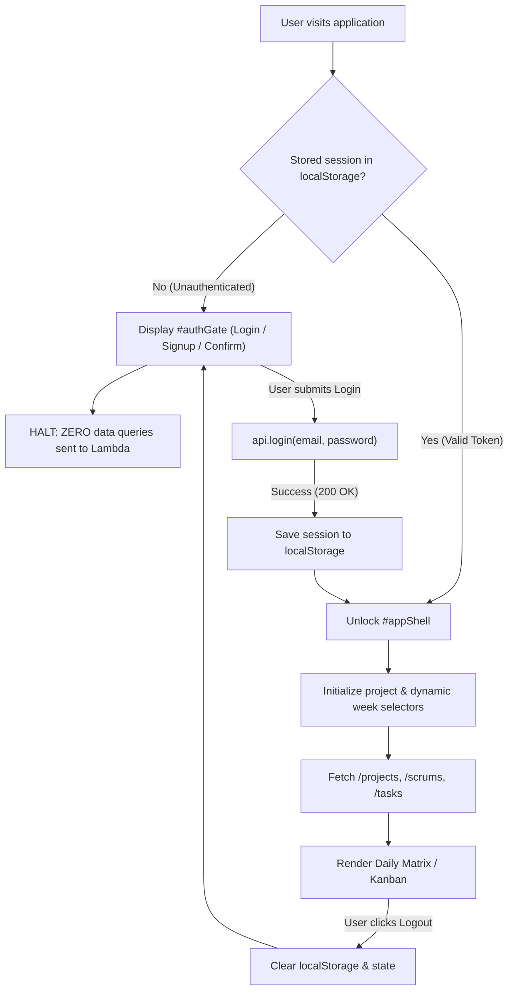

# Frontend Architecture Reference

This document details the client-side architecture, atomic directory structure, and security gate implementation of the **Daily Scrum Serverless** web application.

---

## 1. Architectural Principles

* **Zero-Build Native ES6+ Modules:** Modern browsers natively execute ES modules via `<script type="module" src="./js/app.js"></script>`. No Node.js build pipeline, webpack, or npm dependencies are required to develop or deploy.
* **Atomic & Screaming Directory Structure:** Code is decomposed by architectural role into focused single-responsibility modules:
  * Design tokens and styling modules under `css/`.
  * Core configuration and reactive state under `js/`.
  * Network communication and utilities under `js/services/`.
  * Independent UI widgets and modal views under `js/components/`.
* **Mandatory Authentication Gate (Zero Data Leak):** The application strictly denies access to any board views or background network requests (`/projects`, `/scrums`, `/tasks`) until an authenticated session is verified.

---

## 2. Directory Structure

```
├── index.html                 # HTML5 Shell & Modal Templates
├── css/
│   ├── variables.css          # Design tokens & Light/Dark theme custom properties
│   ├── base.css               # Global reset, typography, buttons, inputs & containers
│   ├── auth.css               # Centered Auth Gate card & login/signup tab styles
│   ├── board.css              # Daily Scrum matrix table, day columns & blocker tags
│   ├── kanban.css             # Kanban board columns, draggable cards & priority badges
│   └── modals.css             # Modal dialog overlays, prompt/confirm dialogs & toasts
├── js/
│   ├── config.js              # Endpoint constants, storage keys, day names & clean URL helper
│   ├── state.js               # Central shared state (currentUser, activeProject, activeWeek, tasks)
│   ├── app.js                 # Application bootstrapper and view coordinator
│   ├── services/
│   │   ├── api.js             # Unified REST client with Authorization headers for AWS Lambda
│   │   ├── dateUtils.js       # Calendar ISO week calculation, current day name & status labels
│   │   └── domUtils.js        # Safe HTML escaping and modal lifecycle controllers
│   └── components/
│       ├── authGate.js        # Mandatory Auth Gate controller (login, signup, confirm, logout)
│       ├── header.js          # App header, user badge, theme toggle & admin button
│       ├── weekSelector.js    # Dynamic week detection (DynamoDB + calendar + ➕ button)
│       ├── dailyMatrix.js     # Weekly Scrum table rendering, cell editing & Daily/Kanban sync
│       ├── kanbanBoard.js     # Kanban flow (TODO, DOING, BLOCKED, DONE) & drag-and-drop
│       ├── adminModal.js      # Admin management modal (projects, members, resend, endpoint)
│       └── uiFeedback.js      # Non-intrusive toasts, async confirm and prompt modals
└── frontend/                  # Synchronized mirror directory for hosting parity
```

---

## 3. Mandatory Authentication Gate

The application enforces a strict security perimeter at entry:



### Unauthenticated State
1. `#appShell` (header, board filters, matrix table, kanban) is explicitly hidden (`display: none;`).
2. `#authGate` is displayed as a centered card with three tabs:
   * **Iniciar Sesión:** Direct email and password login.
   * **Crear Cuenta:** User registration requiring email verification via Resend.
   * **Activar Cuenta:** 6-digit confirmation code verification.
3. **No Background Data Fetching:** `initProjectSelectors()`, `api.getProjects()`, and `api.getWeeklyScrums()` are NOT called until authentication succeeds.

### Session Management
* Stored in `localStorage` under `daily_scrum_auth_session`.
* Includes user profile (`email`, `name`, `role`, `title`, `is_admin`) and JWT/HMAC bearer token.
* `getAuthHeaders()` in `js/services/api.js` automatically attaches `Authorization: Bearer <token>` to all protected endpoints.
* Clicking **🚪 Salir** (Logout) clears credentials, purges active table DOM elements, and resets the interface to the Auth Gate.

---

## 4. Component Breakdown

### A. Dynamic Week Selector (`weekSelector.js`)
* Automatically fetches existing active weeks for the selected project from DynamoDB via `GET /scrums?project={name}`.
* Calculates the current calendar week using standard ISO-8601 rules (`getCalendarWeekNumber()`).
* Merges and numerically sorts existing weeks + current week.
* Includes a `➕` button next to the selector that appends and selects the next chronological week on demand.

### B. Daily Scrum Matrix (`dailyMatrix.js`)
* Renders weekly rows for each assigned team member.
* Columns: `Integrante | Rol | Lunes | Martes | Miércoles | Jueves | Viernes | Sábado | Domingo`.
* Cell click opens the Daily Scrum editor modal (`#scrumModal`) with the 3 canonical questions:
  1. ¿Qué hiciste?
  2. ¿Con qué sigues?
  3. ¿Bloqueos o Impedimentos?
* Provides bidirectional synchronization with the Kanban board: completed and in-progress tasks automatically populate answers.

### C. Kanban Board (`kanbanBoard.js`)
* 4-column Scrumban workflow: `TODO`, `DOING`, `BLOCKED`, `DONE`.
* Native HTML5 drag-and-drop with column highlight and status updates.
* Role-based protection: members can move/claim their own tasks; admins can reassign and move all tasks.
* Auto-sync bridge: moving tasks updates the member's daily entry for the current day.

### D. Admin Modal (`adminModal.js`)
* Gated to users with `role: "admin"` or `is_admin: true`.
* **Proyectos:** Create, rename, delete, and toggle self-assignment permissions (`🔓 Abierto` / `🔒 Cerrado`).
* **Integrantes:** Add, edit, or remove members and roles by project.
* **Email (Resend):** Manage Resend API Key and sender email for account confirmation codes.
* **Endpoint Lambda:** Inspect and customize the backend AWS Lambda Function URL for the client.

### E. UI Feedback (`uiFeedback.js`)
* `showToast(message, type)`: Animated floating notifications.
* `showConfirm(title, message)`: Promise-based replacement for `window.confirm`.
* `showPrompt(options)`: Promise-based replacement for `window.prompt`.
